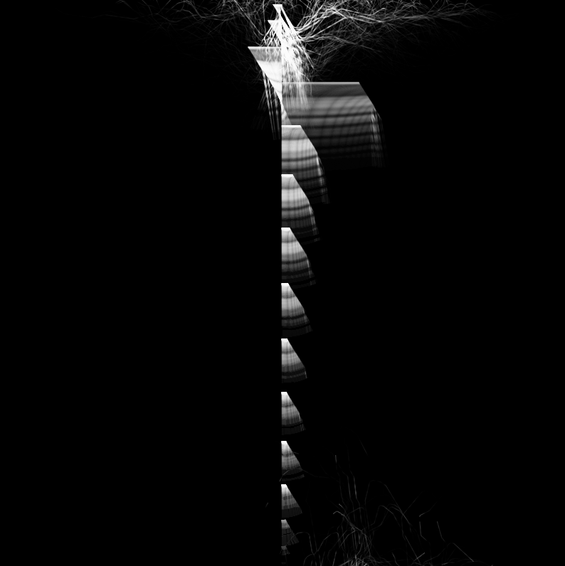

# portfolio-sketch-2

**title:** _cascading slime mold_

**description:**

This sketch is made using p5js. It is a simulation made in p5js that is meant to mimick a slime mold, while also broken in such a way that reveals its digital nature. It is meant resemble a living thing, while also being obvious it is a digital thing at the same time.

You can interact with this sketch here: https://saicoshore.github.io/portfolio-sketch-1/
